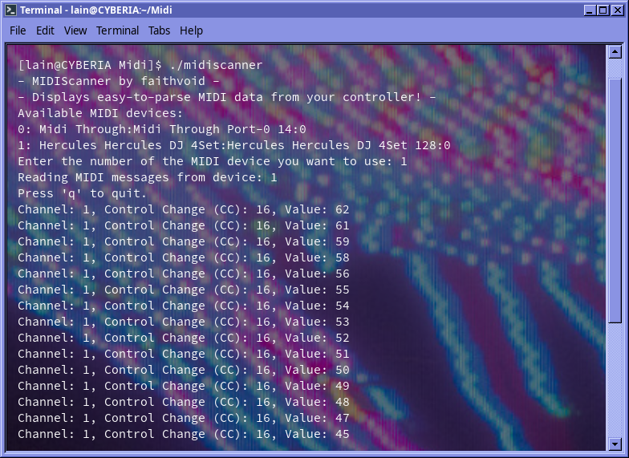

# MIDIScanner

MIDIScanner - A small utility to grab note/velocity/CC data from MIDI devices in real time. Originally designed to be used with Mixxx for controller mapping, but there are all sorts of practical applications!

Currently this is Linux-only, but as RTMidi is cross-platform, it probably(?) compiles on other platforms. YMMV. 

## How to Build:
- Open your Terminal application
- Go to the directory where MIDIScanner is saved and type "./midiscanner" into the terminal (you may have to type "chmod +x midiscanner" first if you get permission issues).
- Select your MIDI device and you're ready to start pressing buttons/knobs and mapping out their values!

## How to Build:
### Linux:
- Install RTMidi dependencies (librtmidi-dev on Ubuntu, rtmidi on Arch Linux, etc.)
- Go into the folder containing "midiscanner.cpp" and run this command in terminal, without quotes: "g++ -std=c++11 midiscanner.cpp -o midiscanner -lrtmidi"

### macOS:
- TBA

### Windows:
- TBA

## To Do:
- Add an LED-locating helper function
- Check error handling
- Port to Python using python-rtmidi
